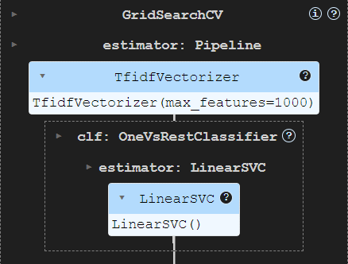

# Research Paper Multilable Classification Project

This repository contains code for a Kaggle competition project focused on classifying research papers into multiple subject areas. The project utilizes both traditional and deep learning approaches.

# Chapter 1 : **Introduction**

## Project Purpose

The purpose of this project is to classify research papers into 18 subject areas

- CE - Civil Engineering
- ENV- Environmental Engineering
- BME - Biomedical Engineering
- PE - Petroleum Engineering
- METAL- Metallurgical Engineering
- ME - Mechanical Engineering
- EE - Electrical Engineering
- CPE - Computer Engineering
- OPTIC - Optical Engineering
- NANO - Nano Engineering
- CHE - Chemical Engineering
- MATENG - Materials Engineering
- AGRI - Agricultural Engineering
- EDU - Education
- IE - Industrial Engineering
- SAFETY - Safety Engineering
- MATH - Mathematics and Statistics
- MATSCI - Material Science

This type of classification supports researchers in finding relevant literature, improves search results in academic databases, and helps to organize collections of scientific publications.

## Multi-label Classification

Multi-label classification is employed in this project due to the potential for research papers to belong to multiple subject areas simultaneously (e.g., a paper at the intersection of Biomedical Engineering and Nanotechnology).

**Table of Contents**

- [Chapter 1: Introduction](#chapter-1-introduction)
- [Chapter 2: Data preparation](#chapter-2-data-preparation)
- [Chapter 3: Model](#chapter-3-model)
- [Chapter 4: Results](#chapter-4-results)
- [Chapter 5: Discussion](#chapter-5-discussion)
- [Chapter 6: Conclusion](#chapter-6-conclusion)

---

# Chapter 2: **Data preparation**

## Data Source:

This project utilizes a dataset containing 454 research paper samples, including titles, abstracts, and corresponding class labels. The data is provided in JSON format and is divided into two files:

- **train_for_student.json**: This file contains the training dataset, which will be used to build the machine learning models.
- **test_for_student.json**: This file contains the testing dataset, used to evaluate the performance of the trained models.
  **JSON Structure**

Each JSON files has the following structure:

- Top-Level Object: The entire dataset is represented as a single JSON object.
- Individual Records: Within the top-level object, each research paper sample is represented as a key-value entry.
  - Key: A unique identifier for the sample (e.g., "001", "002eval").
  - Value: An object containing the following information about the research paper:
    - Title: The title of the research paper.
    - Abstract: Abstarct of the research paper.
    - Classes: A list of classes/categories the research paper belongs to (e.g., "CHE", "MATENG", "CPE").

**train_for_student.json**

```json TRAIN
{
    "001": {
        "Title": "Activated carbon derived from bacterial cellulose and its use as catalyst support for ethanol conversion to ethylene",
        "Abstract": "\u00a9 2019 Elsevier B.V.Activated carbon derived from bacterial cellulose (BC-AC) ...",
        "Classes": [
            "CHE",
            "MATENG"
        ]
    },
    "002": {
        "Title": "The algorithm of static hand gesture recognition using rule-based classification",
        "Abstract": "\u00a9 Springer International Publishing AG 2018.Technology becomes a part of ...",
        "Classes": [
            "CPE"
        ]
    },
    ...
}
```

**test_for_student.json**

```json TEST
{
    "001eval": {
        "Title": "Comparative Electrical Energy Yield Performance of Micro-Inverter PV Systems Using a Machine Learning Approach Based on a Mixed-Effect Model of Real Datasets",
        "Abstract": "\u00a9 2013 IEEE.Long-term energy evaluation of PV systems that use micro-inverter ..."
    },
    "002eval": {
        "Title": "Effects of graphene nanoplatelets on bio-based shape memory polymers from benzoxazine/epoxy copolymers actuated by near-infrared light",
        "Abstract": "\u00a9 The Author(s) 2021.Novel near-infrared (NIR) light-induced bio-based shape ..."
    },
    ...

}
```

## Preprocessing Steps:

1. Target Class Encoding

- I employed multi-label binarization to transform the target classes into a binary matrix representation. This format is suitable for multi-label classification, where each column signifies a potential class.

  ```python
  multilabel = MultiLabelBinarizer()
  y = multilabel.fit_transform(df['Classes'])
  ```

2. Feature Engineering

- I utilized TF-IDF (Term Frequency-Inverse Document Frequency) to convert the textual data (titles and abstracts) into numerical vectors. TF-IDF highlights the importance of words within a document relative to their frequency across the entire dataset.

## Data Splitting:

I implemented an 80/20 train/test split. This ensures a sufficient amount of data for model training while reserving a portion for unbiased performance evaluation.

---

# Chapter 3: Model

### Data Pipeline

#### The Purpose of a Pipeline

- **Streamlining**: Pipelines chain together multiple steps involved in a machine learning process, from data preprocessing to model training. This creates a more organized and reproducible workflow.
- **Modularity**: Individual components of the pipeline (e.g., feature extractors, classification algorithms) can be easily replaced or modified. This flexibility supports experimentation and optimization.
- **Hyperparameter Optimization**: Pipelines integrate seamlessly with tools like GridSearchCV, allowing you to tune parameters across all the steps simultaneously.

#### Components of Pipeline

```python
from sklearn.pipeline import Pipeline
pipeline = Pipeline([
    ('tfidf', TfidfVectorizer(analyzer='word', max_features=1000)),
    ('clf', OneVsRestClassifier(LinearSVC(), n_jobs=1)),
])
```

1. **Feature Engineering**: ('tfidf', TfidfVectorizer(analyzer='word', max_features=1000))

- **TF-IDF**: Stands for Term Frequency - Inverse Document Frequency. This is a classic technique for representing text as numerical vectors. It emphasizes words that are important within a document and rare across the entire collection, helping to identify distinctive terms for each subject area.

- **analyzer='word'**: Tokenizes the text into individual words. This makes sense for general language, but for specialized research papers, you might experiment with character-level or n-gram tokenization.

- **max_features=1000**: Limits the vocabulary to the 1000 most frequent words. This helps control the vector dimensions and can prevent overfitting on rare terms.

2. **Multi-label Classification**: ('clf', OneVsRestClassifier(LinearSVC(), n_jobs=1))

- OneVsRestClassifier: A meta-classifier that adapts traditional binary classifiers (like LinearSVC) to handle multi-label problems. It trains one classifier per possible label in your dataset.

- LinearSVC: A support vector machine for classification. Linear SVCs often work well with text data due to its high-dimensional nature. They are also relatively fast to train and can be interpretable.

- n_jobs=1: Specifies that training should happen on a single CPU core. Increase this if you have more cores available for faster processing.

### Model Choice and Rationale:

I selected LinearSVC within a OneVsRestClassifier for multi-label classification. Linear models are often a good baseline due to their speed and interpretability, making them suitable for understanding text features important for classification.



### Hyperparameter Tuning:

- Method: GridSearchCV with Cross-Validation
- Parameter Grid

```python
parameters = {
    'tfidf__max_df': (0.75, 0.85, 0.95),
    'tfidf__min_df': (0.01, 0.05, 0.1),
    'clf__estimator__C': (0.01, 0.1, 1, 10, 100, 1000, 10000)
}
```

Explanation of Parameters

- **tfidf\_\_max_df**: Controls the maximum proportion of documents a term can appear in.
- **tfidf\_\_min_df**: Controls the minimum number of documents a term must appear in.
- **clf**\_\_**estimator**\_\_**C**: Regularization strength in the LinearSVC classifier. Larger values mean less regularization.

- Best Parameters

```python
[('tfidf', TfidfVectorizer(max_df=0.85, max_features=1000, min_df=0.01)), ('clf', OneVsRestClassifier(estimator=LinearSVC(C=100), n_jobs=1))]

```

---

# Chapter 4: **Results**

### Performance Metrics:

Used F1-score (weighted) and recall (weighted) as they are well-suited for multi-label problems where class imbalance might exist.

**Scores**

F1 score: 0.54

Recall score: 0.50

### Confusion Matrix of every classes:

Confusion matrices for each class provide a detailed breakdown of the model's predictions.

[Link to Folder of image](https://github.com/tumrabert/kaggle_text_multilabel_classification/tree/main/img/confusion_matrices)

### Kaggle Screenshot:

Image of Kaggle Submission and Score


### Interpretation

- Baseline Acknowledgement:

  The model demonstrates baseline functionality, indicating it has learned patterns for classifying research papers. However, the scores suggest substantial room for improvement.

---

# Chapter 5: **Discussion**

### Improvement Strategies:

- Alternative Models:

Experimenting with tree-based ensembles (e.g., Random Forest, XGBoost) or transformer-based models (e.g., BERT, RoBERTa) could improve performance. These models often excel at capturing complex patterns and non-linear relationships in text data.

- Feature Engineering:

Exploring techniques like word embeddings (e.g., Word2Vec, GloVe) or topic modeling (e.g., LDA) might provide richer and more informative text representations for classification.

- Data Augmentation:

If permitted by the competition, techniques to increase dataset size and diversity could boost performance.

## Chapter 6: **Conclusion**

### Key Findings:

This project successfully demonstrates the feasibility of multi-label classification for research papers. While the initial linear model establishes a baseline, the results highlight the potential for significant improvement by exploring the strategies outlined above.

### Challenges and Future Directions:

A key challenge faced in this project was the limited amount of labeled data.

Future work should prioritize addressing this limitation. Additionally, investigating the use of advanced deep learning models and sophisticated feature engineering techniques promises a path toward building more accurate classification systems.
